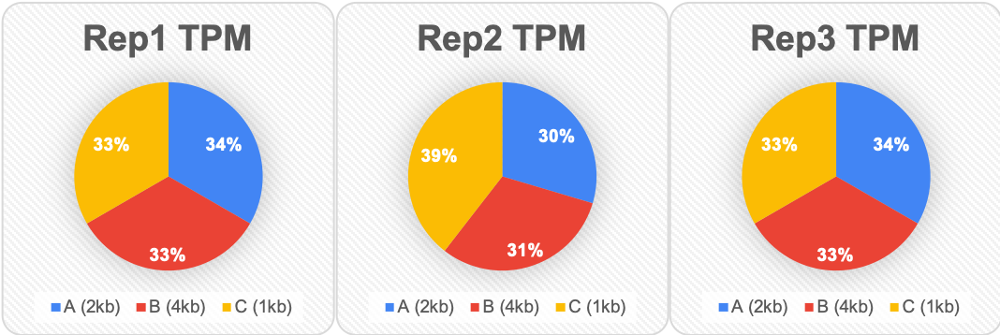

생물 정보학에서 굉장히 흔하게 접할 수 있는 용어 중 하나로 **RPKM, FPKM, TPM**이 있습니다. 

RNA-seq의 발현 분석에서 normalized gene expression을 의미하는 것으로 초창기에는 RPKM이 많이 쓰였으나 FPKM을 거쳐 현재에는 TPM을 주로 사용하고 있습니다. (FPKM 또한 많이 사용중)

따라서 이 3가지 값을 계산하는 방법을 소개하려고 합니다. 아래 순서대로 이해하시면 됩니다.

먼저 A, B, C, D라는 4개의 gene과 3개의 replicate를 가지고 있는 테이블이 있습니다.
gene 옆에 있는 kb(kilobase)는 gene의 길이입니다.

<table>
<thead>
<tr>
<th>Gene Name</th>
<th>Rep1 Counts</th>
<th>Rep2 Counts</th>
<th>Rep3 Counts</th>
</tr>
</thead>
<tbody>
<tr>
<td>A (2kb)</td>
<td>10</td>
<td>12</td>
<td>30</td>
</tr>
<tr>
<td>B (4kb)</td>
<td>20</td>
<td>25</td>
<td>60</td>
</tr>
<tr>
<td>C (1kb)</td>
<td>5</td>
<td>8</td>
<td>15</td>
</tr>
<tr>
<td>D (10kb)</td>
<td>0</td>
<td>0</td>
<td>1</td>
</tr>
</tbody>
</table>

Rep3를 보면 gene에 상관없이 다른 replicate들보다 많은 reads를 가진 것을 알 수 있습니다. 이는 sequencing depth가 다른 replicate들보다 높다는 걸 의미합니다. 이제 이걸 normalize(정규화) 할 것입니다.

또한 gene B는 gene A에 2배에 해당하는 '길이'를 가지고 있고, 이건 replicate에 상관없이 2배 많은 reads를 가지고 있다는 것을 설명하는 것일 수도 있습니다. 우리는 이것도 정규화해보려고 합니다.

## RPKM

RPKM은 single-end RNA-seq용으로 제작되었습니다.
먼저 사자성어 풀이하듯 각 알파벳의 의미를 먼저 살펴보겠습니다. **R**eads **P**er **K**ilobase per **M**illions mapped reads

그러면 이게 무슨 뜻이냐...하면 전체 유전자의 길이를 Kilobase(=1000 base pair)로 정규화했을 때 전체 reads 중에서 해당 gene에 mapping된 reads들을 말합니다. 그런데 이 수는 너무 적기 때문에 106을 곱해주게 됩니다.

즉 FPKM은 total (1)reads에서 gene에 매핑된 리드들 나눈 값, (2) gene의 전체 길이를 1000으로 나눈 값, (3)106을 곱해주면 됩니다.

즉, gene 단위의 expression입니다.

이해가 잘 안되신다면 직접 계산해볼까요?

<table>
<thead>
<tr>
<th>Gene Name</th>
<th>Rep1 Counts</th>
<th>Rep2 Counts</th>
<th>Rep3 Counts</th>
</tr>
</thead>
<tbody>
<tr>
<td>A (2kb)</td>
<td>10</td>
<td>12</td>
<td>30</td>
</tr>
<tr>
<td>B (4kb)</td>
<td>20</td>
<td>25</td>
<td>60</td>
</tr>
<tr>
<td>C (1kb)</td>
<td>5</td>
<td>8</td>
<td>15</td>
</tr>
<tr>
<td>D (10kb)</td>
<td>0</td>
<td>0</td>
<td>1</td>
</tr>
</tbody>
</table>

먼저, **(1) read depth**를 정규화합니다.

- 각각의 replicate들에서 총 reads의 수를 계산합니다.

<table>
<thead>
<tr>
<th>Gene Name</th>
<th>Rep1 Counts</th>
<th>Rep2 Counts</th>
<th>Rep3 Counts</th>
</tr>
</thead>
<tbody>
<tr>
<td>Total reads</td>
<td>35</td>
<td>45</td>
<td>106</td>
</tr>
</tbody>
</table>

- 이 Total reads를 106으로 나누어야 하는데 보기 쉽게 10으로만 나눠보겠습니다.

<table>
<thead>
<tr>
<th>Gene Name</th>
<th>Rep1 Counts</th>
<th>Rep2 Counts</th>
<th>Rep3 Counts</th>
</tr>
</thead>
<tbody>
<tr>
<td>Tens of reads</td>
<td>3.5</td>
<td>4.5</td>
<td>10.6</td>
</tr>
</tbody>
</table>

따라서 이 값들은 각 replicate들에 대한 "per million" scaling factors입니다. 그러니까 우리는 각 gene의 read counts을 이 값들로 나누어야 합니다. 그러면 우리는 reads per million을 계산할 수 있는데 이를 **RPM**이라고 해보죠.

<table>
<thead>
<tr>
<th>Gene Name</th>
<th>Rep1 RPM</th>
<th>Rep2 RPM</th>
<th>Rep3 RPM</th>
</tr>
</thead>
<tbody>
<tr>
<td>A (2kb)</td>
<td>2.86</td>
<td>2.67</td>
<td>2.83</td>
</tr>
<tr>
<td>B (4kb)</td>
<td>5.71</td>
<td>5.56</td>
<td>5.66</td>
</tr>
<tr>
<td>C (1kb)</td>
<td>1.43</td>
<td>1.78</td>
<td>1.42</td>
</tr>
<tr>
<td>D (10kb)</td>
<td>0</td>
<td>0</td>
<td>0.09</td>
</tr>
</tbody>
</table>

두 번째 단계는 **(2) gene length로 정규화**하는것입니다. 각 replicate의 counts를 gene length(**K**ilobase)로 나누면 됩니다. 쉽죠? 그러면 아래의 테이블이 나오게 됩니다.

<table>
<thead>
<tr>
<th>Gene Name</th>
<th>Rep1 RPKM</th>
<th>Rep2 RPKM</th>
<th>Rep3 RPKM</th>
</tr>
</thead>
<tbody>
<tr>
<td>A (2kb)</td>
<td>1.43</td>
<td>1.33</td>
<td>1.42</td>
</tr>
<tr>
<td>B (4kb)</td>
<td>1.43</td>
<td>1.39</td>
<td>1.42</td>
</tr>
<tr>
<td>C (1kb)</td>
<td>1.43</td>
<td>1.78</td>
<td>1.42</td>
</tr>
<tr>
<td>D (10kb)</td>
<td>0</td>
<td>0</td>
<td>0.009</td>
</tr>
</tbody>
</table>

자 그러면 우리는 RPKM을 가지게 되었습니다.

**정리해볼까요?**

우리는 depth와 gene length을 정규화하지 않은 데이터를 가지고 있었습니다.

<table>
<thead>
<tr>
<th>Gene Name</th>
<th>Rep1 Counts</th>
<th>Rep2 Counts</th>
<th>Rep3 Counts</th>
</tr>
</thead>
<tbody>
<tr>
<td>A (2kb)</td>
<td>10</td>
<td>12</td>
<td>30</td>
</tr>
<tr>
<td>B (4kb)</td>
<td>20</td>
<td>25</td>
<td>60</td>
</tr>
<tr>
<td>C (1kb)</td>
<td>5</td>
<td>8</td>
<td>15</td>
</tr>
<tr>
<td>D (10kb)</td>
<td>0</td>
<td>0</td>
<td>1</td>
</tr>
</tbody>
</table>

하지만 우리는 이제 각각의 sequencing depth와 각각의 gene length에 대해 정규화해서 각각의 replicate와 각각의 gene에 대한 RPKM 데이터를 가지게 되었습니다.

<table>
<thead>
<tr>
<th>Gene Name</th>
<th>Rep1 RPKM</th>
<th>Rep2 RPKM</th>
<th>Rep3 RPKM</th>
</tr>
</thead>
<tbody>
<tr>
<td>A (2kb)</td>
<td>1.43</td>
<td>1.33</td>
<td>1.42</td>
</tr>
<tr>
<td>B (4kb)</td>
<td>1.43</td>
<td>1.39</td>
<td>1.42</td>
</tr>
<tr>
<td>C (1kb)</td>
<td>1.43</td>
<td>1.78</td>
<td>1.42</td>
</tr>
<tr>
<td>D (10kb)</td>
<td>0</td>
<td>0</td>
<td>0.009</td>
</tr>
</tbody>
</table>

## FPKM

RPKM과 유사한 이름을 가지고 있는 FPKM은 **F**ragment **P**er **K**ilobase of transcript per **M**illion mapped reads의 약자입니다. **paired-end**로 RNA-seq을 하면 하나의 fragment에서 2개의 read가 나옵니다. (_RPKM의 무조건 2배가 되는건 아닙니다_) 이는 transcript 관점의 expression으로 볼 수 있습니다.

RPKM과 FPKM의 차이점은 FPKM은 두개의 reads가 하나의 fragment에 mapping된다는 점을 고려한다는 것입니다.

## TPM

TPM은 Transcripts Per Million의 약자로 FPKM, RPKM과 유사한 개념이지만 transcript length의 분포까지 포함한 개념이라고 합니다.  

TPM을 계산하는 방법 아래와 같습니다.

RPKM / Total RPKM * 10^6

흠.. 같이 봐볼까요?

<table>
<thead>
<tr>
<th>Gene Name</th>
<th>Rep1 Counts</th>
<th>Rep2 Counts</th>
<th>Rep3 Counts</th>
</tr>
</thead>
<tbody>
<tr>
<td>A (2kb)</td>
<td>10</td>
<td>12</td>
<td>30</td>
</tr>
<tr>
<td>B (4kb)</td>
<td>20</td>
<td>25</td>
<td>60</td>
</tr>
<tr>
<td>C (1kb)</td>
<td>5</td>
<td>8</td>
<td>15</td>
</tr>
<tr>
<td>D (10kb)</td>
<td>0</td>
<td>0</td>
<td>1</td>
</tr>
</tbody>
</table>

먼저 (1) 각 replicate의 counts를 gene length로 나눕니다. 그러면 아래의 테이블이 나오겠죠? **RPK**는 **R**eads **P**er **K**ilobase라는걸 알 수 있습니다.

<table>
<thead>
<tr>
<th>Gene Name</th>
<th>Rep1 RPK</th>
<th>Rep2 RPK</th>
<th>Rep3 RPK</th>
</tr>
</thead>
<tbody>
<tr>
<td>A (2kb)</td>
<td>5</td>
<td>6</td>
<td>15</td>
</tr>
<tr>
<td>B (4kb)</td>
<td>5</td>
<td>6.25</td>
<td>15</td>
</tr>
<tr>
<td>C (1kb)</td>
<td>5</td>
<td>8</td>
<td>15</td>
</tr>
<tr>
<td>D (10kb)</td>
<td>0</td>
<td>0</td>
<td>0.1</td>
</tr>
</tbody>
</table>

두 번째 단계로 (2) sequencing depth로 정규화하는 것입니다. 우리가 gene lengh을 정규화한 것들의 합(각 replicate read counts의 합)과 각 replicate의 RPK 수를 합하고 (원래는 10^6으로 나눠야 하지만) 10으로 나눈 Tens of RPK를 사용할 것입니다.

<table>
<thead>
<tr>
<th>Gene Name</th>
<th>Rep1 RPK</th>
<th>Rep2 RPK</th>
<th>Rep3 RPK</th>
</tr>
</thead>
<tbody>
<tr>
<td>Total RPK</td>
<td>15</td>
<td>20.25</td>
<td>45.1</td>
</tr>
<tr>
<td>Tens of RPK</td>
<td>1.5</td>
<td>2.025</td>
<td>4.51</td>
</tr>
</tbody>
</table>

각 replicate의 counts를 Tens of RPK로 나누게 되면 TPM이 완성됩니다.

<table>
<thead>
<tr>
<th>Gene Name</th>
<th>Rep1 TPM</th>
<th>Rep2 TPM</th>
<th>Rep3 TPM</th>
</tr>
</thead>
<tbody>
<tr>
<td>A (2kb)</td>
<td>3.33</td>
<td>2.96</td>
<td>3.326</td>
</tr>
<tr>
<td>B (4kb)</td>
<td>3.33</td>
<td>3.09</td>
<td>3.326</td>
</tr>
<tr>
<td>C (1kb)</td>
<td>3.33</td>
<td>3.95</td>
<td>3.326</td>
</tr>
<tr>
<td>D (10kb)</td>
<td>0</td>
<td>0</td>
<td>0.02</td>
</tr>
</tbody>
</table>

## 그래서 이게 뭘 의미하는데?

그렇죠 계산하는 방법만 알면 다가 아니죠. 이 둘(RPKM과 TPM)이 뭐가 다른지 알아야겠지요. RPKM과 TPM을 비교해봅시다. 

### RPKM

<table>
<thead>
<tr>
<th>Gene Name</th>
<th>Rep1 RPKM</th>
<th>Rep2 RPKM</th>
<th>Rep3 RPKM</th>
</tr>
</thead>
<tbody>
<tr>
<td>A (2kb)</td>
<td>1.43</td>
<td>1.33</td>
<td>1.42</td>
</tr>
<tr>
<td>B (4kb)</td>
<td>1.43</td>
<td>1.39</td>
<td>1.42</td>
</tr>
<tr>
<td>C (1kb)</td>
<td>1.43</td>
<td>1.78</td>
<td>1.42</td>
</tr>
<tr>
<td>D (10kb)</td>
<td>0</td>
<td>0</td>
<td>0.009</td>
</tr>
<tr>
<td>Total</td>
<td>4.29</td>
<td>4.5</td>
<td>4.25</td>
</tr>
</tbody>
</table>

### TPM

<table>
<thead>
<tr>
<th>Gene Name</th>
<th>Rep1 TPM</th>
<th>Rep2 TPM</th>
<th>Rep3 TPM</th>
</tr>
</thead>
<tbody>
<tr>
<td>A (2kb)</td>
<td>3.33</td>
<td>2.96</td>
<td>3.326</td>
</tr>
<tr>
<td>B (4kb)</td>
<td>3.33</td>
<td>3.09</td>
<td>3.326</td>
</tr>
<tr>
<td>C (1kb)</td>
<td>3.33</td>
<td>3.95</td>
<td>3.326</td>
</tr>
<tr>
<td>D (10kb)</td>
<td>0</td>
<td>0</td>
<td>0.02</td>
</tr>
<tr>
<td>Total</td>
<td>10</td>
<td>10</td>
<td>10</td>
</tr>
</tbody>
</table>

위 결과들은 같은 데이터에서 나온 RPKM과 TPM 값입니다.  둘 다 gene length와 sequencing depth의 편향(bias)이 일치합니다. 하지만 각 column에 대한 정규화된 총 reads는 매우 다릅니다.

1. RPKM은 각 sample마다 다른 값을 얻었습니다.
2. TPM은 각 column마다 같은 값을 얻었습니다.

왜 이 차이가 중요한지 봐봅시다.

### Comparison among TPMs

### Comparison among RPKMs...?

감이 오시나요?

TPM은 모든 replicate에 대하여 총 count 수가 보정되었기 때문에 각 gene에 어떤 비율로 reads가 있는지 알 수 있습니다. 예를 들어 Rep1의 gene A는 33%라고 알 수 있습니다. 그리고 이를 통해 Rep2의 gene A와 비교하였을 때 Rep1의 gene A가 Rep2의 gene A보다 약간 크다고 알 수 있습니다. 이는 Rep1의 gene A에 맵핑된 양이 Rep3의 gene A에 맵핑된 양보다 미세하게 더 많다는 걸 알 수 있습니다.

하지만 RPKM은 각각의 replicate가 다른 total reads를 가지기 때문에 각각의 replicate의 gene을 비교하기 어렵습니다. 이 말은 각각의 gene의 reads 수를 비교하기 어렵다는 말이 됩니다.

## 따라서

sample들 안에서 맵핑되는 reads의 비율을 보다 명확하게 말해주는 **TPM**을 사용하기를 추천드립니다.

---

##  Reference

- https://www.youtube.com/watch?v=TTUrtCY2k-w

- https://www.rna-seqblog.com/rpkm-fpkm-and-tpm-clearly-explained/
- http://www.incodom.kr/Expression_profiling

---

