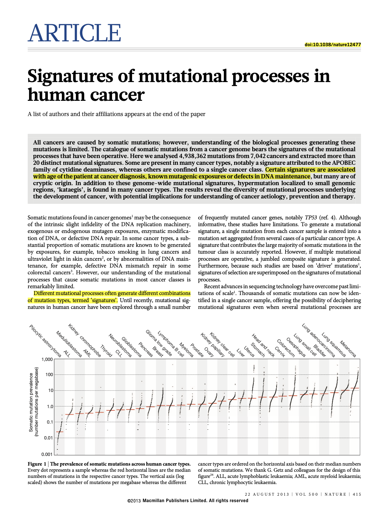
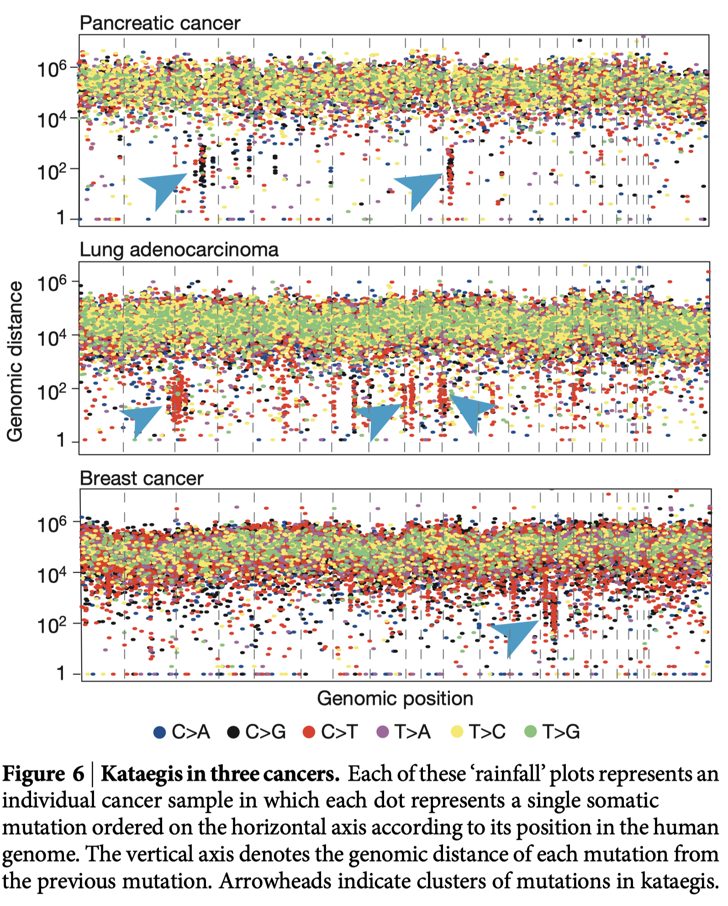

# [논문요약]Signatures of mutational processes in human cancer

### 1. Mutational catalogues

somatic mutations(체세포 돌연변이)의 유병률은 암 종류들 내에서 매우 다양하며, megabase(Mb) 당 0.001에서 400까지 다양하다.
->우리가 아는 자외선을 많이 쐬면 피부암 발병률이 높아지고, 흡연을 많이 하면 폐암 발병률이 높다는 것과 같이 만성 돌연변이 유발성 노출과 관련된 암은 가장 높은 유병률을 보여준다.

### 2. The landscape of mutational signatures

원칙적으로 모든 종류의 mutations(substitutions, indels, rearrangements)와 모든 accessory matations들의 특성은 mutational signatures가 정의되는 특징들의 집합에 포함될 수 있다.

염기 치환(base substitution)을 사용해서 mutational signatures을 추출하고 추가적으로 각각의 mutations의 서열 context에 대한 정보를 포함했다.
6가지 종류의 염기 치환(base substitution)-C>A, C>G, C>T, T>A, T>C, T>G-이 있고 5'과 3' 염기에 대한 정보를 각 mutation base에 통합하였기 때문에 96개의 mutations 분류가 가능하다. 이 96개의 substitution classification은 '동일한 substitution을 유발하지만 다른 서열 context에서 발생하는 mutational signatures을 구별'하는데 유용하게 사용한다.

substitution mutation이 가능한 96개의 경우 중 1개 또는 2개만이 두드러지는 특징을 가지는 signatures가 있으며, 이는 mutation types 및 서열 context의 특이성을 보여준다.
대부분의 암 종에서 최소 2개의 mutational signatures가 관찰되었으며, liver, uterus and stomach에서 최대 6개가 관찰됨. 이러한 차이는 부분적으로 signatures 추출 능력의 차이에 원인이 있을수 있지만, 일부 암은 다른 암보다 더 복잡한 돌연변이 과정 레퍼토리를 가지고 있는 것으로 보여진다.

### 3. Mutational signatures and age of cancer diagnosis

signature 1A/B는 소아 및 성인 암 types의 대부분에서 age와 강한 상관관계를 보였다. 진단 연령과의 상관관계는 암 환자의 일생 동안 암 유전자의 1A/B 기질의 상당 부분이 다른 사람들(normal somatic tissues)과 비슷하게 일정한 비율로 발생된다는 가설과 일치한다.

연령에 따른 모든 signatures에 대한 일관된 상관관계가 없다는 것은 이러한 signatures와 관련된 mutations이 다른 사람에서 다른 비율로 생성되었음을 시사한다. 아마도 다른 발암물질 노출의 결과 또는 neoplastic change가 시작된 후에 발생할 수 있다.

### 4. Thus.

numan cancer의 기초가 되는 somatic mutations의 과정의 다양성과 복잡성은 현재 암 genome에 묻혀있는 mutations의 패턴을 통해 밝혀지고 있다. 전체 genome 시퀀싱된 암의 수가 증가하고 분석방법이 더욱 개선됨에 따라 그 특징에 대한 보다 정확한 정의와 함께 더 많은 mutation signatures가 추출 될 가능성이 높다.

---

##  Reference

- [Signatures of mutational processes in human cancer | Nature](https://www.nature.com/articles/nature12477)

---

