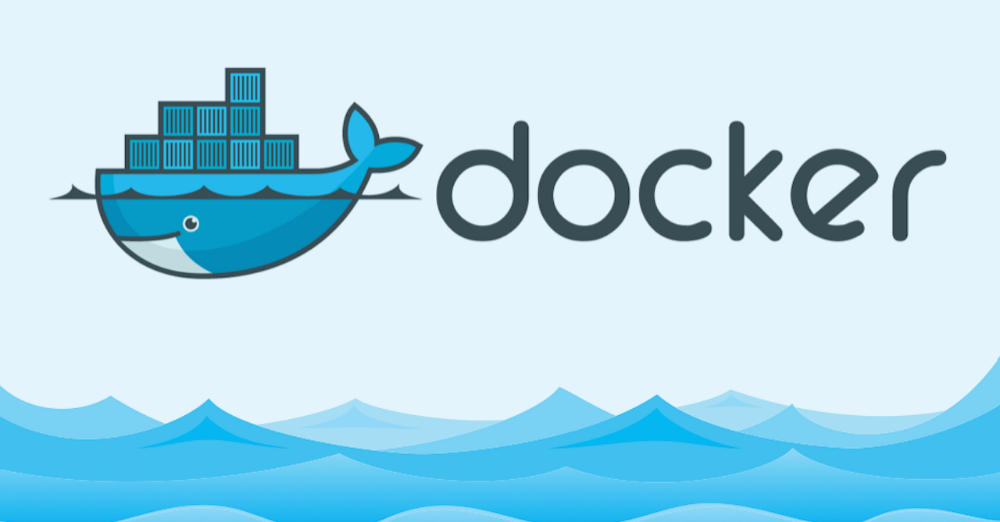

## 들어가면서

docker를 사용하다 보면 많은 이미지와 컨테이너를 다루게 됩니다. 따라서 docker 기본 경로에는 많은 용량이 누적되게 되고, 물리적인 용량 부족 문제를 겪게 됩니다. 용량 부족문제가 아니게 되더라도 사용하지 않는 이미지와 컨테이너를 삭제함으로 여유공간을 더욱 확보할 수 있게 됩니다. 이에 따라 해결방법을 알아보겠습니다.

## 해결방법

해결 방법에는 몇 가지가 있습니다. 

### 1. 안쓰는 이미지, 컨테이너 삭제

컨테이너와 이미지를 `rm` 또는 `rmi` 명령어를 사용해서 지웠다고 하더라도 docker 경로의 용량변화는 없게 됩니다. 그럴 경우 아래의 명령어로 안쓰는 이미지와 컨테이너를 삭제 할 수 있습니다. 아래의 명령어에 대한 자세한 내용은 [docker docs](https://docs.docker.com/engine/reference/commandline/system_prune/#description) 를 참고해주세요.

```bash
docker system prune -a -f
```

`-a` `-f` 옵션에 대한 설명입니다.

- `-a` - 컨테이너에 연결되지 않은 사용하지 않는 모든 이미지들 제거.
- `-f` - 프롬프트로 확인을 하지 않음.

### 2. docker 기본 경로 변경

{}
💡 docker 기본 경로를 변경하면 기존 경로에 있던 이미지와 컨테이너들은 삭제됩니다. 미리 백업해두시길 바랍니다.
{}

docker가 이미지, 컨테이너를 저장하고 기타 파일을 저장하기 위해 사용하는 경로는 `/var/lib/docker/` 입니다. 이 경로를 넉넉한 용량을 가진 디렉토리로 변경해주면 용량 문제를 벗어날 수 있겠죠?

{}
🙋🏻‍♂️ 아래의 방법은 도커 설정 파일을 통해 변경하는 방법입니다. `/lib/systemd/system/docker.service` 파일을 수정하는 방법도 있지만 아래의 방법을 권장합니다.
{}

`daemon.json` 파일을 만들어줍니다. 이 파일은 기본적으로 존재하지 않습니다. 따라서 아래의 경로에 만들어 주어야 합니다.

```bash
vi /etc/docker/daemon.json
```

변경될 경로를 넣어줍니다. 이렇게 되면 도커가 실행할 때 저 파일을 읽어 path를 결정합니다.

```json
{
  "graph": "/home/path" # 원하는 경로로 설정
}
```

`json` 파일을 저장하고 도커를 재시작합니다.

```bash
sudo systemctl restart docker

# systemctl 명령어가 사용되지 않을 경우
sudo service docker start
```

컨테이너를 실행하고 도커를 확인(`ps -ef | grep docker`)하면 아래처럼 변경된 경로로 나오는 것을 확인할 수 있습니다.

```bash
root     21800 19983  0 10:52 ?        00:00:00 docker-containerd-shim -namespace moby -workdir /home/ykkim/docker/containerd/daemon/io.containerd.runtime.v1.linux/moby/8adc00f3bbdd4fd44110f42a7b25e8598019963a83b6b8d3d29266c426701db8 -address /var/run/docker/containerd/docker-containerd.sock -containerd-binary /usr/bin/docker-containerd -runtime-root /var/run/docker/runtime-runc
```

이렇게 해서 docker 기본 경로를 변경하게 됩니다.

