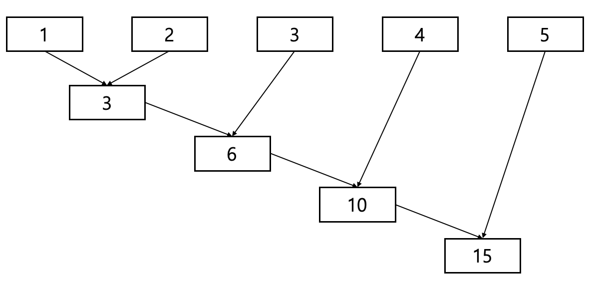

파이썬의 기본을 한 번 끝낸 후, 조금 더 심화된 파이썬 문법을 필요로 한다면 배워볼 수 있는 문법들입니다. 중급 문법들은 파이썬을 조금 더 쉽게 작성할 수 있도록 도와주고 불필요한 반복을 없애주죠. 이번 시간에는 map, filter, reduce에 대해 배워볼건데 이 3가지 함수들은 list를 다루는 함수입니다. 물론 기본 문법에서 배운 것처럼 이 3가지 함수를 사용하지 않아도 코딩하는 것에는 문제가 없습니다. 하지만 저의 경우에는 아래의 3가지 함수를 통해 반복문을 덜 사용하게 되었고, 불필요한 함수를 따로 만들어줄 필요가 없어서 편했습니다.

자 그러면 시작해볼까요?

## map

`map` 은 리스트의 각 요소들을 지정된 함수로 처리하는 기능을 합니다. 쉽게 말하면 A라는 함수가 있고 list B가 있다면 A함수를 B로 수행한 결과를 돌려주는 거라고 할 수 있습니다.

먼저 `for` 반복문을 사용하여 정수가 저장된 리스트를 제곱하고 2로 나누어 볼까요?

```python
a = [1, 2, 3, 4]
result = []

for i in range(len(a)):
    result.append(a[i] ** 2 / 2)

print(result)
```

1, 2, 3, 4의 정수 리스트를 받아 제곱을 해주고 2로 나눠주는 코드입니다. 간단하죠? 실행 결과는 다음과 같습니다.

> 결과 : [0.5, 2.0, 4.5, 8.0]

이 예제를 `map` 함수를 사용해볼까요?

```python
a = [1, 2, 3, 4]

print(list(map(lambda x: x**2/2, a)))
```

똑같이 4개의 정수를 각 element를 받아 제곱을 해주고 2로 나눠주는 코드입니다. `map` 함수 앞에서 `list` 함수를 통해 list 자료형으로 변환하는 이유는 `map` 함수의 반환이 list가 아니기 때문인데요. `Iterator` 로 반환하는 값을 list로 변환하는 것입니다.(Iterator에 대해서는 다음에 따로 글을 써보겠습니다.)

## filter

정의 : 무엇을 걸러내다.

실제 filter 함수의 쓰임도 정의와 같습니다. `filter` 은 A라는 함수에 대해 리스트 B의 element 중 참에 해당하는 값을 돌려주는 것이라고 할 수 있습니다.

```python
a = [-3, -2, -1, 0, 1, 2, 3]
print(list(filter(lambda x: x>0, a)))
```

-3에서 3까지의 정수중에서 0보다 큰 값을 돌려주는 코드입니다. ~~참 쉽죠?~~

### 이 방법이 괜찮은데?

하지만 꼭 이 방법만을 써야하는건 아닙니다. 우리에게는 `list comprehension` 이 있습니다.

map 함수를 list comprehension으로 구현해 볼까요?

```python
a = [1, 2, 3, 4]
print([x**2/2 for x in a])
```

오히려 더 간결한 것 같기도 하고..

filter 함수도 마찬가지입니다.

```python
a = [-3, -2, -1, 0, 1, 2, 3]
print([x for x in a if x>0])
```


이처럼 방금 배운 map과 filter가 마음에 들지 않으면 list comprehensiond을...쓸 수도 있습니다.

## reduce

`reduce` 는 원래는 내장함수였는데 python 3부터 내장함수에서 빠지고 functools에서 가져와야 합니다.

reduce에 대한 원리는 그림 한장으면 끝납니다.




아이큐 테스트같지만 1부터 5까지 차례대로 더하는 거라는 걸 알 수 있겠죠? 수식으로 표현해 본다면 다음과 같습니다.

```
((((1+2)+3)+4)+5)
```

코드로 작성해 보면 아래와 같습니다.

```python
from functools import reduce

a = [1, 2, 3, 4, 5]
print(reduce(lambda x, y: x+y, a))
```

`reduce` 함수의 경우에는 list comprehension로 대체할 수 없습니다. 이유는 reduce 함수는 2 element가 입력으로 들어가게 되는데 list comprehension은 2가지 입력을 받지 못하기 때문입니다.

